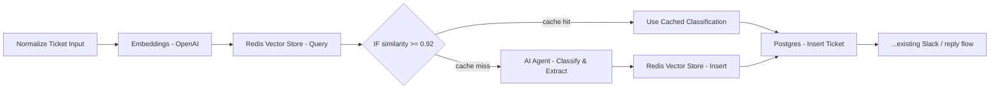

# Semantic Cache for Ticket Classifier (Redis Vector Store)

## Why

Every incoming ticket currently calls the OpenAI-backed AI Agent for classification, even
when the message is a near-duplicate of one we've already classified (e.g. "internet is
down" vs "no connectivity at the office" vs "network outage at HQ"). This adds unnecessary
LLM cost and latency.

A **semantic cache** stores the embedding of each classified ticket alongside its
classification result. When a new ticket comes in, we embed it and search for the closest
previously-seen ticket. If it's similar enough (cosine similarity above a threshold), we
reuse the cached classification and skip the LLM call entirely. If not, we classify
normally and store the new result for future hits.

This is different from the automatic prompt caching built into Azure OpenAI / AWS Bedrock /
OpenAI itself, which only caches an *exact* repeated prompt prefix — it does nothing for
semantically similar but differently-worded messages, which is the common case for support
tickets.

## Architecture

## Infrastructure

- New `redis` service in `docker-compose.yml` using `redis/redis-stack-server` (not plain
  `redis` — vector similarity search requires the RediSearch module, which only ships in
  the "stack" image).
- New Redis credential in n8n (host: `redis`, port: `6379`, no auth for local demo).

## Workflow changes

1. **Embeddings - OpenAI** (`@n8n/n8n-nodes-langchain.embeddingsOpenAi`) — embeds
   `$json.message` from "Normalize Ticket Input".
2. **Redis Vector Store - Query** (`@n8n/n8n-nodes-langchain.vectorStoreRedis`, "Get Many"
   / retrieve mode) — searches the `ticket-cache` index for the nearest match and returns
   its similarity score plus stored metadata (category, priority, summary, confidence).
3. **IF - Cache Hit** — `similarity >= 0.92`.
   - **True (cache hit):** map the cached metadata into the same shape the AI Agent would
     have produced (`output.category`, `output.priority`, `output.summary`,
     `output.confidence`), skip the AI Agent, and continue into the existing
     Postgres/Slack/reply flow.
   - **False (cache miss):** run "AI Agent - Classify & Extract" as before, then add a
     **Redis Vector Store - Insert** step that stores the ticket's embedding with its
     classification result as metadata, before continuing into the existing flow.

## Status

- [x] `redis` service added to docker-compose.yml
- [x] Redis credential created in n8n
- [ ] Embeddings + Vector Store query nodes added and wired
- [ ] Cache-hit branch mapped to existing downstream nodes
- [x] Cache-miss branch inserts new embedding + result after classification
      (currently unconditional — every ticket is classified and inserted; will become
      conditional once the query/IF branch below is added)
- [ ] Tested: same message twice → second run shows cache hit (no AI Agent execution)
- [ ] Tested: worded differently but same issue → still hits cache
- [ ] Tested: unrelated new ticket → cache miss, classifies normally

### Implementation note

`AI Agent - Classify & Extract` fans out to **two parallel branches**: `Postgres - Insert
Ticket` (unchanged main flow) and `Redis Vector Store` (insert mode, side-effect only —
its output is not consumed downstream). This was necessary because the Vector Store
node's insert-mode output replaces the item with LangChain `Document` objects
(`{ metadata, pageContent }`), which would break the Postgres node's expressions if
chained serially.

The Default Data Loader feeding the insert node uses:
- **Data**: `={{ $('Normalize Ticket Input').first().json.message }}` (must be a plain
  string — passing an object causes the JSON loader to split each string property into
  its own document)
- **Metadata**: `category`/`priority`/`summary`/`confidence` from `$json.output.*`
  (AI Agent's output shape), plus `customerId` from
  `$('Normalize Ticket Input').first().json.customerId`
